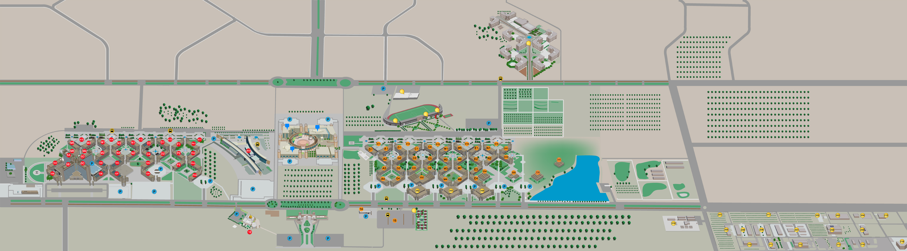
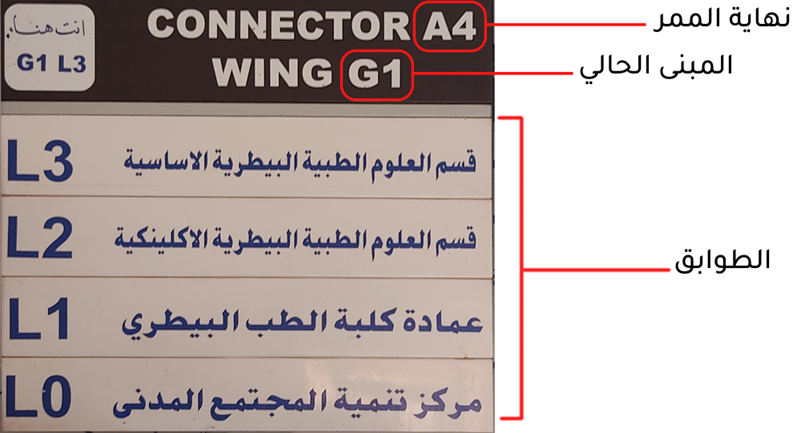
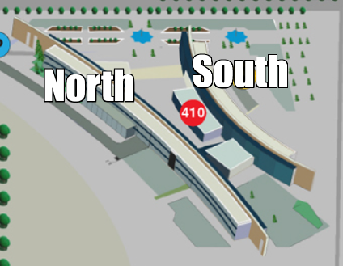

# خريطة الجامعة

## الخارطة الرسمية للجامعة

بداية رح نحكي عن خريطة الجامعة والي هي من أهم الامور في سنوات الاولى.

[خارطة الجامعة](https://www.just.edu.jo/Pages/JUST_Maps.aspx
)

ننصح متابعينا بتنزيل خريطة Just Online Map ورسم عليها من نقطة البداية و تسلسلاً بالمحاضرات.

> طيب أنا جوا سكويرات وتهت شو أعمل؟

اطلع برا السكوير وشوف أي رمز على المباني
وارجع شيك عالخريطة.

## نظام قراءة أسماء أماكن المحاضرات

> كمثال أول على موقع محاضرة سيكون A3128

بنقدر نقسم اسم موقع المحاضرة لعدة امور لفهمه 

جزئية الـA - - - - > السكوير

رقم المبنى < - - - - جزئية الـ3

رقم القاعدة داخل المبنى < - - - -  جزئية الـ128

> كمثال ثاني على موقع المحاضرة سيكون **CPE05 - E4L1**

جزئية الـCPE - - - - > اسم القسم

رقم اللاب <  - - - -  جزئية الـ05

جزئية الـE4L1 - - - - > موقعه وينقسم الى:

E4 - - - - > المبنى الرابع في سكوير E

L1 - - - - > الطابق رقم واحد

### الطوابق 

  
عند دخولك إلى أي مبنى في أي سكوير عادة ما سترى لافتة لترشدك أين أنت وإلى أين أنت ذاهب وكمثال عليها:

> كمثال ثالث على موقع المحاضرة سيكون NB67 

N --> المول من جهة North

B --> الطابق المسمى Basement وهو الأدنى بالترتيب

67 ---> رقم القاعة 

### المول 

بالبداية لازم نوضح أن القاعات التي تكون على الصيغة التالية:
- NB, NG, NF 
- SB, SG, SF 

بتكون قاعات تابعة للمول (المبنى الي كله زجاج)  وموجود لافتة في كل مدخل للمول لتحكيلك شو القاعات الموجودة عيمينه وعيساره. 

للتوضيح بترتيب الطوابق:: 
1.  NB (North Basement) - طابق أول 
2.  NG (North Ground) - طابق ثاني 
3.  NF (North Floor) - طابق ثالث

والامر نفسه للقاعات في الجانب South 

## معلومات اضافية:: 

### الفرق بين  M الطبية و M الهندسية:: 

1- 

الحرف M للطبية 

وحرف m للهندسية 

2- 

اذا كان رقم القاعة اكبر من 200 بتكون طبية 

أقل من 200 هندسية 

أمثلة::

m2008 هندسية 

M2201 طبية 

### لابات الاقسام

بتقدر تشيك كل قسم شو عنده لابات من خلال تصفح موقع القسم ومن ثم research واختيار  Labs and Facilities

مثال:

[مختبرات قسم هندسة الحاسوب](https://www.just.edu.jo/FacultiesandDepartments/it/Departments/cpe/Pages/labs_facilities.aspx)

